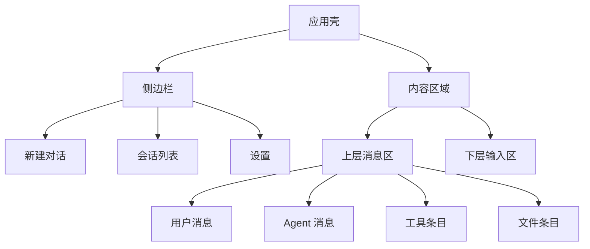

# 密码方案生成Agent UI设计文档

## 1. 设计目标

本产品的 UI 形态应为“侧边栏 + 内容区域”，而不是多工作台拼板。用户的主要心智应该非常直接：

1. 左侧边栏负责导航、新建对话和设置。
2. 右侧内容区域负责完整的对话与生成过程。
3. 聊天页面固定分成上下两层：
   - 上层展示用户消息、Agent 消息和工具调用过程
   - 下层展示输入区域、附件区域和发送控制
4. 用户不用切到多个页面就能完成资料输入、过程查看和文件接收。

## 2. 目标用户

1. 密码应用方案编制人员。
2. 项目售前或咨询顾问。
3. 建设单位信息化负责人。
4. 内部合规审查和交付人员。

这些用户共同特点是：

1. 专业，但未必熟悉 Agent 技术。
2. 更关注方案结果是否专业、过程是否可控。
3. 更偏向桌面办公软件的稳定体验，而不是复杂仪表盘。

## 3. 视觉方向

### 3.1 风格关键词

1. 专业
2. 稳定
3. 文档感
4. 过程透明
5. 偏政企桌面工具气质
6. 接近 Codex 的会话式工具调用体验

### 3.2 色彩建议

建议避免常见的紫色 AI 风格，采用“深蓝 + 石板灰 + 纸面白”的方向。

```css
:root {
  --bg-app: #f3f5f7;
  --bg-sidebar: #eef2f6;
  --bg-surface: #ffffff;
  --bg-composer: #fbfcfd;
  --bg-accent: #e9f1fb;
  --text-primary: #102033;
  --text-secondary: #516173;
  --text-muted: #7e8b99;
  --line-soft: #d9e2ea;
  --line-strong: #b8c5d1;
  --brand-600: #1b4f8a;
  --brand-500: #2a6bb3;
  --success: #1f7a4d;
  --warning: #b7791f;
  --danger: #b53a32;
}
```

### 3.3 字体建议

1. 中文：`Source Han Sans SC` 或 `HarmonyOS Sans SC`
2. 英文和数字：`IBM Plex Sans`
3. 文档预览区域可搭配 `Source Han Serif SC` 强化“成文感”

### 3.4 Markdown 渲染方案

Markdown 渲染明确采用 Incremark：

1. 官网：<https://www.incremark.com/zh/>
2. React 包：`@incremark/react`
3. 主题样式：`@incremark/theme/styles.css`

采用原因：

1. Incremark 是为 AI 流式输出设计的增量解析器，适合长对话和长方案输出。
2. Assistant 文本可以边生成边渲染，不需要每次全量重算 Markdown。
3. 对表格、列表、长段落和长文档边界处理更稳，适合方案正文、制度条目和技术说明。

渲染约束：

1. Assistant 正文消息通过 `IncremarkContent` 渲染。
2. 每条 Assistant 消息维护独立 `content` 缓冲。
3. 消息完成前持续增量更新。
4. 工具调用条目不走 Markdown 解析，直接作为消息流中的原生 UI 行渲染。

## 4. 信息架构



### 4.1 一级结构

1. 侧边栏
2. 对话内容区
3. 模板与设置弹层

### 4.2 布局原则

1. 侧边栏常驻在左侧，负责导航，不承载主要业务细节。
2. 内容区域是唯一主舞台。
3. 内容区域内部再固定拆分为上层消息区和下层输入区。
4. 资料详情、模板校验结果、产物详情等次级信息，优先用抽屉、弹层或二级页承载，不打断主会话。

## 5. 核心页面设计

### 5.1 应用主界面

#### 布局草图

```text
+----------------------------------------------------------------------------------+
| 侧边栏                             | 内容区域                                    |
|------------------------------------+---------------------------------------------|
| Logo / 产品名                      | 顶栏：项目名 / 模板版本 / 当前状态          |
| 新建对话                           |---------------------------------------------|
| 会话搜索                           | 上层：消息区                                |
| 会话列表                           | - 用户消息                                  |
| 项目切换                           | - Agent Markdown                            |
| 设置                               | - 工具调用条目                              |
|                                    | - 文件发送条目                              |
|                                    |---------------------------------------------|
|                                    | 下层：输入区                                |
|                                    | - 多行输入框                                |
|                                    | - 已选择文件列表                            |
|                                    | - 选择文件按钮 / 粘贴提示 / 发送按钮        |
+----------------------------------------------------------------------------------+
```

#### 侧边栏设计

侧边栏宽度建议 `240px - 280px`，采用“导航优先”设计。

包含内容：

1. 产品标识和当前项目名。
2. `新建对话` 主按钮。
3. 会话搜索框。
4. 会话列表。
5. `设置` 入口。

必须保留的两个一级动作：

1. `新建对话`
2. `设置`

#### 内容区域设计

内容区域分为三段：

1. 顶栏：显示项目名、模板版本、当前状态、停止生成、导出入口。
2. 上层消息区：展示会话内容与工具调用过程。
3. 下层输入区：负责用户输入、文件选择、粘贴附件和发送。

### 5.2 侧边栏交互设计

#### 会话列表

每个会话条目展示：

1. 标题
2. 最近消息摘要
3. 最近更新时间
4. 当前状态

状态包括：

1. `空闲`
2. `生成中`
3. `待补资料`
4. `已完成`
5. `失败`

#### 新建对话

点击 `新建对话` 后：

1. 创建新会话
2. 内容区清空到新会话上下文
3. 输入区自动聚焦
4. Agent 可立即开始引导式采集

#### 设置入口

设置建议以独立页面或弹层呈现，不建议放入聊天主流中。

设置页重点项：

1. OpenAI Chat 模型配置
2. OpenAI 生图模型配置
3. `.env` 配置路径与状态
4. 模板设置
5. 工具权限设置

### 5.3 聊天页面设计

#### 上层消息区

上层消息区是一个可滚动区域，负责展示：

1. 用户消息
2. Agent 流式回复
3. 工具调用条目
4. 阶段提示行
5. 文件发送条目

消息区要求：

1. Agent 回复必须支持流式增量展示。
2. 工具调用要穿插在聊天中，而不是跑到单独面板。
3. 文件产物要直接以内联条目展示。
4. 长会话自动滚动时，用户手动上滑后应暂停自动滚动。

#### 下层输入区

下层输入区固定吸附在底部，建议高度 `160px - 220px`，分成三部分：

1. 多行输入框
2. 附件区
3. 发送控制区

输入区必须支持：

1. 文本输入
2. 粘贴文件
3. 选择文件
4. 展示待发送文件列表
5. 发送消息
6. 停止生成

#### 附件交互

附件支持两种来源：

1. 用户点击 `选择文件`
2. 用户直接在输入区粘贴文件

建议支持的文件类型：

1. `.docx`
2. `.pdf`
3. `.md`
4. `.txt`
5. `.png` `.jpg`
6. `.xlsx`，如后续要采集设备清单

待发送文件应在输入区上方以紧凑列表展示：

1. 文件名
2. 类型
3. 大小
4. 删除按钮

### 5.4 设置页

#### 页面目标

设置页主要负责模型配置和运行配置，不承担日常聊天功能。

#### 关键设置项

1. `OPENAI_BASE_URL`
2. `OPENAI_CHAT_MODEL`
3. `OPENAI_IMAGE_MODEL`
4. `OPENAI_IMAGE_SIZE`
5. `OPENAI_REQUEST_TIMEOUT_MS`
6. API Key 状态

设置页应明确提示：

1. 配置来源于 `.env` / `.env.local`
2. API Key 不在前端明文暴露
3. 修改配置后可能需要重新加载 Agent Runtime

### 5.5 产物页

#### 页面目标

集中查看当前项目所有生成产物。

#### 主要分类

1. `Word`
2. `PDF`
3. `图示`
4. `中间稿`

#### 列表字段

1. 文件名
2. 文件类型
3. 生成时间
4. 来源会话
5. 是否最终版
6. 操作：打开、定位、重新发送

## 6. 核心交互设计

### 6.1 新建对话流程

1. 用户点击侧边栏 `新建对话`
2. 系统创建新会话
3. 内容区切换到新会话
4. 输入框自动聚焦
5. Agent 开始引导用户输入系统资料

### 6.2 用户输入与附件流程

1. 用户输入文本。
2. 用户可选择文件，或直接粘贴文件。
3. 文件进入待发送列表。
4. 用户点击发送后，文本与附件一起进入会话。
5. Agent 在消息区流式回复。

### 6.3 流式回复流程

1. 用户发送消息
2. 内容区顶部出现新的 Assistant 消息占位
3. Agent 通过流式事件不断追加内容
4. Incremark 持续增量渲染
5. 消息完成后进入稳定态

### 6.4 工具调用展示流程

1. Agent 开始调用工具
2. 消息区插入工具条目
3. 工具状态从 `执行中` 更新到 `成功/失败`
4. 如果工具产出文件，则在同一上下文位置继续插入文件条目

### 6.5 文件发送流程

1. Agent 调用 `send_file`
2. 后端登记 artifact
3. 消息区插入文件条目
4. 用户可直接点击打开或定位文件

## 7. 关键组件设计

### 7.1 侧边栏组件

组成：

1. 标识区
2. 新建对话按钮
3. 会话搜索框
4. 会话列表
5. 设置入口

### 7.2 消息流组件

消息类型：

1. 用户消息
2. Agent Markdown 消息
3. 工具条目
4. 阶段提示消息
5. 文件条目

### 7.3 输入区组件

组成：

1. 多行输入框
2. 选择文件按钮
3. 粘贴提示区
4. 待发送文件列表
5. 发送按钮
6. 停止按钮

### 7.4 设置表单组件

建议字段：

1. Chat 模型
2. 生图模型
3. API Base URL
4. 超时设置
5. 输出长度限制

### 7.5 文件条目组件

字段：

1. 文件名
2. 类型标签
3. 版本号
4. 生成时间
5. 操作按钮

## 8. 文档感增强设计

为了让整个 UI 更贴近“方案编制工作”，建议加入以下视觉语言：

1. 顶栏显示当前模板版本和编制日期。
2. 侧边栏列表采用稳重的文档导航样式。
3. 文档预览区使用浅暖白背景，增强纸面感。
4. 工具条目使用紧凑的状态行，而不是夸张卡片。
5. 关键生成按钮使用深蓝主按钮，不要用过度发亮的 AI 渐变色。

## 9. 状态与异常设计

### 9.1 空状态

1. 无会话时：提示用户新建对话。
2. 无消息时：展示引导文案和可点击的快捷问题。
3. 无产物时：提示“尚未生成交付文件”。

### 9.2 异常状态

1. 模型配置缺失：提示检查 `.env`。
2. 工具失败：在消息流中展示错误摘要和重试入口。
3. 资料不足：在消息流中插入待补资料提示。
4. 文件不支持：在输入区直接反馈。

### 9.3 长任务状态

长任务需要明确的阶段进度，而不是只有全局 loading。

建议阶段条：

1. `资料分析`
2. `需求建模`
3. `图示生成`
4. `文档渲染`
5. `文件交付`

## 10. 响应式与窗口策略

本产品以桌面端为主，但仍建议定义三个宽度档：

1. `>= 1600px`：完整侧边栏 + 内容区
2. `1280px - 1599px`：侧边栏可折叠
3. `< 1280px`：侧边栏进入抽屉态，内容区优先保留

Electron 窗口建议最小宽度 `1280px`，最小高度 `800px`。

## 11. 与 shadcn/ui 的组件映射

| 场景 | 建议组件 |
| --- | --- |
| 侧边栏 | `ScrollArea` `Button` `Input` |
| 会话 Markdown | `@incremark/react` `IncremarkContent` |
| 消息流容器 | `ScrollArea` `Separator` |
| 工具条目 | `Accordion` `Badge` `Tooltip` |
| 输入区 | `Textarea` `Button` `ScrollArea` |
| 附件列表 | `Badge` `Button` |
| 设置页 | `Tabs` `Form` `Input` `Select` `Switch` |
| 产物列表 | `Table` `ContextMenu` |

## 12. 结论

这套 UI 的核心不是“堆很多功能面板”，而是把用户最常用的动作压缩到一个非常明确的壳子里：左边管理会话，右边完成对话，聊天页上面看消息，下面发输入。这样既符合桌面端习惯，也最适合你的 Agent 流式回复、工具穿插展示和文件交付场景。
## 当前实现基线（2026-05-23）

- 聊天区域已按 Codex 风格展示消息、阶段行、工具调用行和文件产物行，未使用层级卡片式布局。
- Markdown 渲染已使用 `@incremark/react` 的 `IncremarkContent`，支持流式内容持续渲染。
- 文件产物行已支持“打开”和“定位”，分别调用后端 `artifact.open` 与 `artifact.reveal`。
- 文件产物行已使用 Radix DropdownMenu 收纳“系统打开”“在文件夹中定位”等次级操作，并保留“查看”作为高频操作。
- 侧边栏已增加“交付文件”入口，打开右侧产物历史面板，可找回历史生成的 Markdown、Word、PDF 和图示文件。
- 侧边栏会话已支持 Radix DropdownMenu 操作菜单，可重命名和删除对话；删除使用 Radix AlertDialog 二次确认。
- 设置面板已使用 Radix Tabs 分为“模型 / 文档 / 高级”，仍然以右侧滑出面板呈现，不进入聊天主流。
- 设置面板高级页已加入 `exec_bash` 显式开关，默认关闭，避免命令执行工具被无意启用。
- 工具调用行支持 `running`、`success`、`failed` 三种状态，失败状态使用独立错误图标显示。
- 输入区支持文本输入、选择文件、粘贴文件；附件在发送前以 chip 形式显示并可移除。
