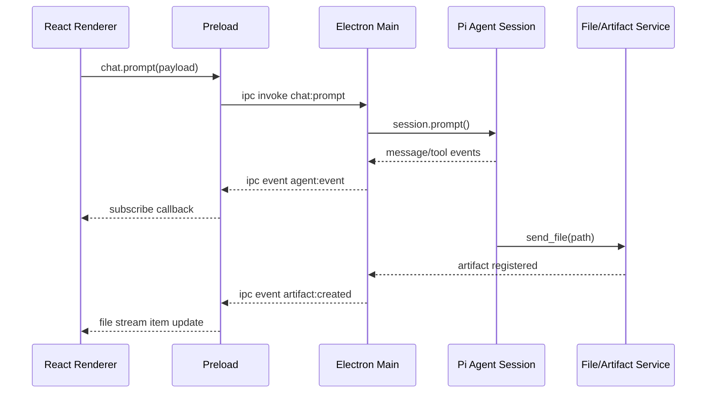

# 密码方案生成Agent接口文档

## 1. 文档范围

本文档定义三类接口：

1. React Renderer 与 Electron Main 之间的 IPC 接口。
2. Electron Main 与 Pi Agent SDK 桥接层之间的会话与事件接口。
3. Agent 自定义工具的输入输出协议。

本文档默认采用 TypeScript 类型描述，便于直接落地到 `electron-vite` 工程。

前端渲染约束：

1. Assistant 文本消息采用 Incremark 渲染。
2. 工具调用、阶段提示、文件发送作为会话流中的独立条目，不走 Markdown 解析。
3. 聊天页面固定为“上层消息区 + 下层输入区”。

## 2. 设计原则

1. 前端不直接接触 Node 能力，只通过 `preload` 暴露安全 API。
2. 所有长任务都采用“命令 + 事件流”模式，而不是单次阻塞调用。
3. 文件必须先登记为 artifact，再允许 `send_file` 或前端打开。
4. 所有事件都带 `projectId`、`sessionId`、`requestId`，便于追踪。
5. `agent.message.delta` 事件必须适配流式 Markdown 累积渲染。

## 3. 通信总览



## 4. Preload 暴露 API

建议前端统一通过 `window.pwdSafeAgent` 调用。

```ts
export interface PwdSafeAgentApi {
  project: {
    list(): Promise<ProjectSummary[]>;
    create(input: CreateProjectInput): Promise<ProjectDetail>;
    get(projectId: string): Promise<ProjectDetail>;
    update(projectId: string, input: UpdateProjectInput): Promise<ProjectDetail>;
    remove(projectId: string): Promise<void>;
  };
  session: {
    list(projectId: string): Promise<SessionSummary[]>;
    create(input: CreateSessionInput): Promise<SessionSummary>;
    resume(sessionId: string): Promise<SessionSummary>;
    abort(sessionId: string): Promise<void>;
  };
  chat: {
    prompt(input: ChatPromptInput): Promise<PromptAccepted>;
    followUp(input: ChatFollowUpInput): Promise<PromptAccepted>;
    steer(input: ChatSteerInput): Promise<PromptAccepted>;
  };
  template: {
    getActive(projectId: string): Promise<TemplateProfile>;
    validate(projectId: string): Promise<TemplateValidationResult>;
    normalize(projectId: string): Promise<TemplateNormalizationJob>;
  };
  artifact: {
    list(projectId: string): Promise<ArtifactSummary[]>;
    open(artifactId: string): Promise<void>;
    reveal(artifactId: string): Promise<void>;
    markFinal(artifactId: string): Promise<void>;
  };
  attachment: {
    pick(input: PickAttachmentInput): Promise<AttachmentRef[]>;
    importClipboard(input: ClipboardAttachmentInput): Promise<AttachmentRef[]>;
    remove(attachmentId: string): Promise<void>;
  };
  settings: {
    get(): Promise<AppSettings>;
    save(input: UpdateAppSettingsInput): Promise<AppSettings>;
    checkRuntime(): Promise<RuntimeCheckResult>;
  };
  events: {
    subscribe(listener: (event: RendererEvent) => void): () => void;
  };
}
```

渲染层建议：

1. React 侧使用 `@incremark/react` 的 `IncremarkContent` 渲染 Assistant 消息。
2. 每条 Assistant 消息维护 `{ content, isFinished }`。
3. `agent.message.delta` 仅追加文本。
4. `agent.message.end` 将 `isFinished` 置为 `true`。
5. 输入区中的附件列表与会话消息分离管理，只有发送时才并入 prompt。

## 5. IPC Channel 设计

### 5.1 Invoke 型接口

| Channel | 方向 | 说明 |
| --- | --- | --- |
| `project:list` | Renderer -> Main | 查询项目列表 |
| `project:create` | Renderer -> Main | 创建项目 |
| `project:get` | Renderer -> Main | 获取项目详情 |
| `project:update` | Renderer -> Main | 更新项目 |
| `project:remove` | Renderer -> Main | 删除项目 |
| `session:list` | Renderer -> Main | 查询项目会话 |
| `session:create` | Renderer -> Main | 创建会话 |
| `session:resume` | Renderer -> Main | 恢复会话 |
| `session:abort` | Renderer -> Main | 中断会话 |
| `chat:prompt` | Renderer -> Main | 发送新提示词 |
| `chat:follow-up` | Renderer -> Main | 在当前队列追加消息 |
| `chat:steer` | Renderer -> Main | 运行中插入引导 |
| `template:get-active` | Renderer -> Main | 获取当前模板 |
| `template:validate` | Renderer -> Main | 校验模板 |
| `template:normalize` | Renderer -> Main | 执行模板归一化 |
| `artifact:list` | Renderer -> Main | 查询产物 |
| `artifact:open` | Renderer -> Main | 打开文件 |
| `artifact:reveal` | Renderer -> Main | 在文件夹中显示 |
| `artifact:mark-final` | Renderer -> Main | 标记为最终版 |
| `attachment:pick` | Renderer -> Main | 通过系统文件选择器导入附件 |
| `attachment:import-clipboard` | Renderer -> Main | 导入用户粘贴的附件 |
| `attachment:remove` | Renderer -> Main | 删除待发送附件 |
| `settings:get` | Renderer -> Main | 读取设置 |
| `settings:save` | Renderer -> Main | 保存设置 |
| `settings:check-runtime` | Renderer -> Main | 执行内置 Python / pip 自检 |

### 5.2 Push 型事件

统一推送频道建议使用 `agent:event` 和 `app:event` 两条：

| Channel | 说明 |
| --- | --- |
| `agent:event` | Agent 会话事件流 |
| `app:event` | 模板处理、文件产物、系统状态事件 |

## 6. 核心数据结构

### 6.1 项目对象

```ts
export interface ProjectSummary {
  id: string;
  name: string;
  owner: string;
  province?: string;
  templateId: string;
  status: "draft" | "collecting" | "analyzing" | "waiting_input" | "ready" | "delivered";
  updatedAt: string;
}

export interface ProjectDetail extends ProjectSummary {
  description?: string;
  facts: ProjectFacts;
  latestSessionId?: string;
  artifactCount: number;
}
```

### 6.2 会话对象

```ts
export interface SessionSummary {
  id: string;
  projectId: string;
  title: string;
  status: "idle" | "running" | "aborted" | "completed" | "failed";
  createdAt: string;
  updatedAt: string;
}
```

### 6.3 产物对象

```ts
export interface ArtifactSummary {
  id: string;
  projectId: string;
  sessionId?: string;
  kind: "docx" | "pdf" | "png" | "json" | "md" | "log";
  name: string;
  path: string;
  relativePath: string;
  size: number;
  mimeType: string;
  isFinal: boolean;
  sourceJobId?: string;
  createdAt: string;
}
```

### 6.4 附件对象

```ts
export interface AttachmentRef {
  id: string;
  projectId: string;
  sessionId?: string;
  name: string;
  mimeType: string;
  size: number;
  path: string;
  source: "picker" | "clipboard" | "drop";
  createdAt: string;
}
```

### 6.5 设置对象

```ts
export interface AppSettings {
  runtime: {
    envFilePath: string;
    configSource: ".env" | ".env.local" | "process";
    bundledPython: {
      available: boolean;
      source?: "resources" | "project";
      homeDir?: string;
      pythonExePath?: string;
      scriptsDir?: string;
    };
  };
  openai: {
    baseUrl: string;
    imageBaseUrl: string;
    chatModel: string;
    imageModel: string;
    imageSize: string;
    imageQuality: string;
    autoImageGeneration: boolean;
    requestTimeoutMs: number;
    imageRequestTimeoutMs: number;
    maxOutputTokens: number;
    apiKeyConfigured: boolean;
    imageApiKeyConfigured: boolean;
  };
  document: {
    autoPdfExport: boolean;
    libreOfficePath: string;
  };
  agent: {
    execBashEnabled: boolean;
    draftSectionParallelism: number;
    imageGenerationParallelism: number;
  };
}

export interface UpdateAppSettingsInput {
  openai: {
    baseUrl: string;
    imageBaseUrl: string;
    chatModel: string;
    imageModel: string;
    imageSize: string;
    imageQuality: string;
    autoImageGeneration: boolean;
    requestTimeoutMs: number;
    imageRequestTimeoutMs: number;
    maxOutputTokens: number;
    apiKey?: string;
    imageApiKey?: string;
  };
  document: {
    autoPdfExport: boolean;
    libreOfficePath: string;
  };
  agent: {
    execBashEnabled: boolean;
    draftSectionParallelism: number;
    imageGenerationParallelism: number;
  };
}

export interface RuntimeCommandCheck {
  ok: boolean;
  command: string;
  source: "bundled" | "system";
  output?: string;
  error?: string;
  durationMs: number;
}

export interface RuntimeCheckResult {
  checkedAt: string;
  bundledPython: AppSettings["runtime"]["bundledPython"];
  python: RuntimeCommandCheck;
  pip: RuntimeCommandCheck;
}
```

### 6.6 项目事实模型

```ts
export interface ProjectFacts {
  basicInfo: {
    systemName?: string;
    owner?: string;
    province?: string;
    address?: string;
    postcode?: string;
    securityLevel?: 1 | 2 | 3 | 4;
  };
  physicalEnv: {
    rooms: RoomInfo[];
  };
  network: {
    zones: NetworkZone[];
    boundaries: string[];
  };
  computing: {
    servers: DeviceInfo[];
    databases: DatabaseInfo[];
    securityDevices: DeviceInfo[];
  };
  business: {
    subsystems: BusinessSubsystem[];
    criticalData: CriticalDataInfo[];
    users: UserRoleInfo[];
  };
  crypto: {
    currentState?: string;
    requirements: CryptoRequirement[];
    devices: CryptoDevicePlan[];
    keyManagement?: KeyManagementPlan;
  };
}
```

## 7. Chat 接口

### 7.1 新提示词

### Request

```ts
export interface ChatPromptInput {
  projectId: string;
  sessionId: string;
  requestId: string;
  message: string;
  attachments?: AttachmentRef[];
  mode?: "chat" | "generate_plan" | "regenerate_section";
  targetSectionCodes?: string[];
}
```

### Response

```ts
export interface PromptAccepted {
  accepted: true;
  requestId: string;
  sessionId: string;
  queued: boolean;
}
```

### 7.2 继续追问

```ts
export interface ChatFollowUpInput {
  sessionId: string;
  requestId: string;
  message: string;
}
```

### 7.3 运行中引导

```ts
export interface ChatSteerInput {
  sessionId: string;
  requestId: string;
  message: string;
}
```

### 7.4 附件导入接口

```ts
export interface PickAttachmentInput {
  projectId: string;
  sessionId?: string;
  multiple?: boolean;
  accept?: string[];
}

export interface ClipboardAttachmentInput {
  projectId: string;
  sessionId?: string;
  source?: "clipboard" | "drop";
  files: Array<{
    name: string;
    mimeType: string;
    dataBase64: string;
  }>;
}
```

## 8. Agent 事件协议

前端不直接消费 Pi 原始事件，建议 Main 进程统一转换为业务事件信封。

```ts
export interface RendererEvent<T = unknown> {
  id: string;
  channel: "agent" | "app";
  eventType: string;
  projectId?: string;
  sessionId?: string;
  requestId?: string;
  timestamp: string;
  payload: T;
}
```

会话流中的条目建议统一建模：

```ts
export type StreamItem =
  | { id: string; kind: "user"; createdAt: string; text: string }
  | { id: string; kind: "assistant"; createdAt: string; content: string; isFinished: boolean }
  | { id: string; kind: "tool"; createdAt: string; toolName: string; status: "start" | "update" | "end"; summary?: string }
  | { id: string; kind: "stage"; createdAt: string; title: string; detail?: string }
  | { id: string; kind: "file"; createdAt: string; artifactId: string; name: string; fileKind: ArtifactSummary["kind"] };
```

### 8.1 消息事件

```ts
export type AgentMessageEvent =
  | {
      eventType: "agent.message.delta";
      payload: {
        role: "assistant";
        delta: string;
        messageId: string;
      };
    }
  | {
      eventType: "agent.message.end";
      payload: {
        role: "assistant";
        messageId: string;
        text: string;
      };
    };
```

前端处理规则：

1. `agent.message.delta` 追加到对应 `assistant` 条目的 `content`。
2. 渲染层把 `content` 直接传给 `IncremarkContent`。
3. 在 `agent.message.end` 到达前，`isFinished` 保持 `false`。
4. 到达结束事件后，再将 `isFinished` 置为 `true`。
5. 消息区上层与输入区下层由不同状态树管理，避免输入态被流式渲染打断。

### 8.2 生命周期事件

```ts
export type AgentLifecycleEvent =
  | { eventType: "agent.turn.start"; payload: { turnId: string } }
  | { eventType: "agent.turn.end"; payload: { turnId: string } }
  | { eventType: "agent.run.start"; payload: { sessionId: string } }
  | { eventType: "agent.run.end"; payload: { sessionId: string } }
  | { eventType: "agent.queue.update"; payload: { followUp: number; steering: number } };
```

### 8.3 工具事件

```ts
export type AgentToolEvent =
  | {
      eventType: "agent.tool.start";
      payload: {
        toolCallId: string;
        toolName: string;
        argsSummary?: string;
      };
    }
  | {
      eventType: "agent.tool.update";
      payload: {
        toolCallId: string;
        toolName: string;
        message?: string;
        partial?: unknown;
      };
    }
  | {
      eventType: "agent.tool.end";
      payload: {
        toolCallId: string;
        toolName: string;
        success: boolean;
        resultSummary?: string;
        artifactIds?: string[];
      };
    };
```

工具事件展示规则：

1. 每次工具调用在会话流中生成一条 `tool` 条目。
2. `start/update/end` 更新同一条目的状态，不额外弹出独立面板。
3. 如果 `artifactIds` 不为空，工具完成条目下方允许直接跳转到文件条目。

### 8.4 应用级事件

```ts
export type AppEvent =
  | {
      eventType: "artifact.created";
      payload: ArtifactSummary;
    }
  | {
      eventType: "template.validation.completed";
      payload: TemplateValidationResult;
    }
  | {
      eventType: "template.normalization.completed";
      payload: TemplateNormalizationJob;
    }
  | {
      eventType: "job.progress";
      payload: {
        jobId: string;
        stage: "fact_modeling" | "section_writing" | "diagram_generation" | "docx_rendering" | "delivery";
        progress: number;
        message?: string;
      };
    };
```

## 9. 模板接口

### 9.1 获取当前模板

```ts
export interface TemplateProfile {
  id: string;
  name: string;
  version: string;
  sourcePath: string;
  normalizedPath?: string;
  mappingPath?: string;
  status: "raw" | "normalized" | "invalid";
}
```

### 9.2 校验模板

```ts
export interface TemplateValidationResult {
  templateId: string;
  valid: boolean;
  issues: Array<{
    code:
      | "PLACEHOLDER_SPLIT"
      | "UNMAPPED_SECTION"
      | "MISSING_IMAGE_ANCHOR"
      | "UNKNOWN_TOKEN";
    level: "info" | "warning" | "error";
    message: string;
    location?: string;
  }>;
  detectedTokens: string[];
}
```

### 9.3 模板归一化任务

```ts
export interface TemplateNormalizationJob {
  jobId: string;
  templateId: string;
  status: "queued" | "running" | "completed" | "failed";
  normalizedPath?: string;
  message?: string;
}
```

## 10. 文件产物接口

### 10.1 查询产物

```ts
export interface ArtifactQuery {
  projectId: string;
  kind?: ArtifactSummary["kind"];
  isFinal?: boolean;
}
```

### 10.2 打开产物

输入：

```ts
{
  artifactId: string;
}
```

返回：

```ts
{
  success: true;
}
```

## 11. Agent 自定义工具协议

### 11.1 `web_search`

### Input

```ts
export interface WebSearchInput {
  query: string;
  domains?: string[];
  limit?: number;
  recencyDays?: number;
}
```

### Output

```ts
export interface WebSearchResult {
  items: Array<{
    title: string;
    url: string;
    snippet: string;
    source?: string;
    publishedAt?: string;
  }>;
}
```

### 11.2 `time`

### Input

```ts
export interface TimeInput {
  timezone?: string;
}
```

### Output

```ts
export interface TimeResult {
  timezone: string;
  iso: string;
  formatted: string;
}
```

### 11.3 `image_generate`

### Input

```ts
export interface ImageGenerateInput {
  prompt: string;
  style?: "enterprise" | "diagram" | "cover";
  size?: "1024x1024" | "1536x1024" | "1024x1536";
  fileName?: string;
  projectId: string;
  sessionId: string;
}
```

### Output

```ts
export interface ImageGenerateResult {
  artifactId: string;
  path: string;
  prompt: string;
  width?: number;
  height?: number;
}
```

说明：

1. 建议由 Main 进程通过 OpenAI 官方 SDK 调用 Images API。
2. 模型、尺寸等参数来自 `.env` / `.env.local`。

### 11.4 `exec_bash`

### Input

```ts
export interface ExecBashInput {
  command: string;
  cwd?: string;
  timeoutMs?: number;
  purpose?: string;
}
```

### Output

```ts
export interface ExecBashResult {
  exitCode: number;
  stdout: string;
  stderr: string;
}
```

### 限制

1. `cwd` 仅允许项目目录、缓存目录和模板工作目录。
2. 默认超时建议 `30s`。
3. 记录完整审计日志。
4. Windows 打包态如果存在 `resources/runtime/win/python/python.exe` 或历史兼容路径 `resources/runtime/win/pyhton/python.exe`，Main 进程会在执行命令前自动注入内置 Python PATH；开发态对应项目根目录下的 `runtime/win/...`。
5. 内置 Python 注入只影响 `exec_bash` 子进程环境，不会修改用户系统环境变量。

### 11.5 `write_file`

### Input

```ts
export interface WriteFileInput {
  path: string;
  content: string;
  overwrite?: boolean;
  encoding?: "utf-8";
}
```

### Output

```ts
export interface WriteFileResult {
  path: string;
  bytesWritten: number;
}
```

### 11.6 `read_file`

### Input

```ts
export interface ReadFileInput {
  path: string;
  startLine?: number;
  endLine?: number;
  encoding?: "utf-8";
}
```

### Output

```ts
export interface ReadFileResult {
  path: string;
  content: string;
}
```

### 11.7 `send_file`

`send_file` 是业务关键工具，它不是“直接给前端一个绝对路径”，而是触发 artifact 注册和会话流文件条目事件。

### Input

```ts
export interface SendFileInput {
  path: string;
  projectId: string;
  sessionId: string;
  displayName?: string;
  kind?: ArtifactSummary["kind"];
  autoOpen?: boolean;
}
```

### Output

```ts
export interface SendFileResult {
  artifactId: string;
  name: string;
  kind: ArtifactSummary["kind"];
  path: string;
}
```

### 行为规范

1. 校验文件存在。
2. 只允许发送 `data/output` 中的产物；`path` 可以是绝对路径、相对项目根目录的 `data/output/...` 路径，也可以是输出目录下的文件名。
3. 将文件写入或登记到 `artifact-service`；同一会话内同一路径不重复生成文件卡片。
4. 触发 `artifact.created` 事件。
5. 如果 `autoOpen = true`，前端收到事件后展示醒目文件条目。

### 11.8 `read_word`

### Input

```ts
export interface ReadWordInput {
  path: string;
  includeTables?: boolean;
  includePlaceholders?: boolean;
}
```

### Output

```ts
export interface ReadWordResult {
  path: string;
  paragraphs: string[];
  tables?: string[][];
  placeholders?: string[];
}
```

### 11.9 `write_word`

### Input

```ts
export interface WriteWordInput {
  templateId: string;
  projectId: string;
  outputName: string;
  data: Record<string, unknown>;
}
```

### Output

```ts
export interface WriteWordResult {
  artifactId: string;
  path: string;
}
```

### 11.10 `read_pdf`

### Input

```ts
export interface ReadPdfInput {
  path: string;
  pageFrom?: number;
  pageTo?: number;
}
```

### Output

```ts
export interface ReadPdfResult {
  path: string;
  pageCount: number;
  text: string;
}
```

### 11.11 `export_pdf`

### Input

```ts
export interface ExportPdfInput {
  sourcePath: string;
  outputName?: string;
}
```

### Output

```ts
export interface ExportPdfResult {
  artifactId: string;
  path: string;
}
```

## 12. Main 进程与 Pi Session / OpenAI 集成建议

### 12.1 Session 创建

推荐封装：

```ts
interface AgentSessionContext {
  projectId: string;
  sessionId: string;
  piSessionId: string;
  cwd: string;
}
```

创建时注入：

1. 自定义系统提示词
2. 工具白名单
3. 当前项目事实快照
4. 模板信息
5. 标准知识文件

### 12.2 OpenAI Chat 接入建议

建议由 `llm-service` 统一封装官方 OpenAI SDK：

```ts
const client = new OpenAI({
  apiKey: process.env.OPENAI_API_KEY,
  baseURL: process.env.OPENAI_BASE_URL,
});

await client.chat.completions.create({
  model: process.env.OPENAI_CHAT_MODEL!,
  messages,
  tools,
  stream: true,
});
```

设计约束：

1. Agent 内部消息需要先转换成 OpenAI `messages[]`。
2. 流式 delta 需要映射为 `agent.message.delta`。
3. tool call 结果需要回写到会话流和审计日志。

### 12.3 OpenAI 生图接入建议

```ts
const imageBaseURL = process.env.OPENAI_IMAGE_BASE_URL || process.env.OPENAI_BASE_URL;
const imageClient = new OpenAI({
  apiKey: process.env.OPENAI_IMAGE_API_KEY || process.env.OPENAI_API_KEY,
  baseURL: imageBaseURL,
});

await imageClient.images.generate({
  model: process.env.OPENAI_IMAGE_MODEL!,
  prompt,
  size: process.env.OPENAI_IMAGE_SIZE,
});
```

### 12.4 Pi 原始事件到业务事件映射

| Pi Event | 业务事件 |
| --- | --- |
| `message_update` | `agent.message.delta` |
| `message_end` | `agent.message.end` |
| `tool_execution_start` | `agent.tool.start` |
| `tool_execution_update` | `agent.tool.update` |
| `tool_execution_end` | `agent.tool.end` |
| `turn_start` | `agent.turn.start` |
| `turn_end` | `agent.turn.end` |
| `agent_start` | `agent.run.start` |
| `agent_end` | `agent.run.end` |

## 13. 错误码建议

| 错误码 | 说明 |
| --- | --- |
| `PROJECT_NOT_FOUND` | 项目不存在 |
| `SESSION_NOT_FOUND` | 会话不存在 |
| `TEMPLATE_INVALID` | 模板不可用 |
| `TEMPLATE_NOT_NORMALIZED` | 模板尚未归一化 |
| `ARTIFACT_NOT_FOUND` | 产物不存在 |
| `TOOL_EXECUTION_FAILED` | 工具执行失败 |
| `PATH_NOT_ALLOWED` | 文件路径非法 |
| `COMMAND_NOT_ALLOWED` | 命令不在白名单 |
| `AGENT_BUSY` | Agent 正在运行，不能重复启动 |

## 14. 推荐接口落地顺序

1. 先完成 `project/*`、`session/*`、`chat.prompt`、`events.subscribe` 最小链路。
2. 再完成 `artifact/*` 和 `send_file` 闭环。
3. 然后实现 `template.validate`、`template.normalize`。
4. 最后补充 `followUp`、`steer`、章节重生成和审计接口。

## 15. 结论

这套接口设计的重点不是做成 HTTP 风格，而是做成桌面端最适合的“IPC 命令 + 事件流”模型。这样既能适配 Pi Agent 的流式事件能力，也能让前端把工具调用过程和文件交付过程展示得足够清楚。
## 当前实现基线（2026-05-23）

- `chat:prompt` 会触发后端 Agent 流程：用户消息入流、进入工具规划、由模型自主判断是否读取模板/附件或调用其他工具，然后流式生成回复；当用户明确需要方案交付时，再写入草稿文件并发送文件卡片。
- 当用户只发送附件但未输入正文时，后端会生成一条“已上传附件”的用户消息，确保会话流和模型上下文都能感知这些可按需读取的资料。
- `session:rename` 支持从侧边栏重命名会话，返回更新后的 `ChatSession` 并推送 `session.updated`。
- `session:delete` 支持删除会话历史，返回删除后的会话列表；若删除最后一个会话，后端会自动创建新的空会话。
- `attachment:pick` 支持选择 `docx/pdf/md/txt/png/jpg/jpeg/xlsx` 等文件，其中 `docx/pdf/md/txt/json/csv/log/yaml/yml` 可进入文本上下文。
- `artifact:list({ sessionId? })` 支持查询全部交付文件或指定会话下的交付文件，用于前端产物历史面板。
- `artifact:open(artifactId)` 用系统默认应用打开生成文件。
- `artifact:reveal(artifactId)` 在文件管理器中定位生成文件。
- `artifact:preview(artifactId)` 返回文本、Markdown、图片或 PDF 预览数据，用于前端侧滑预览面板。
- `stream.item.added` 与 `stream.item.updated` 用于前端增量展示消息、工具调用、阶段提示和文件卡片。
- `session.deleted` 用于前端同步移除会话，并保持侧边栏当前选择始终有效。
- 后端内置直接调用 `@mariozechner/pi-coding-agent`，不再通过环境变量动态加载插件包，也不回退到自实现 OpenAI Chat Runtime。
- `AGENT_EXEC_BASH_ENABLED` 已作为设置项暴露，当前默认启用；设置为 `false` 后 Agent 不再注册和执行 `exec_bash` 工具。
- `AGENT_DRAFT_SECTION_PARALLELISM` 已作为设置项暴露，控制 `draft_scheme_sections` 默认并行起草章节数，默认值为 `20`；工具参数 `max_parallel` 仅覆盖单次调用。
- `AGENT_IMAGE_GENERATION_PARALLELISM` 已作为设置项暴露，控制 `image_generate` 同时执行数量，默认值为 `10`。
- `exec_bash` 已支持 Windows 内置 Python runtime：优先使用随安装包复制到 `resources/runtime/win/python` 或 `resources/runtime/win/pyhton` 的运行时，保障无系统 Python 环境也能执行 Python 命令。
- `settings:get` 的 `runtime.bundledPython` 会返回内置 Python 探测状态，设置面板据此展示当前来源和 `python.exe` 路径。
- `settings:check-runtime` 会实际执行 Python 与 pip 版本检测，设置面板可显示自检结果，便于定位运行时缺 DLL、权限或杀软拦截问题。
- 打包态内置 `.env` 读取自 `resources/.env`，`.env.local`、`data/state.json`、附件缓存和生成产物保存到 Electron `userData` 目录；开发态仍使用项目根目录，便于调试。
- `OPENAI_IMAGE_BASE_URL` 已作为设置项暴露；填写后仅生图请求使用该地址，留空时沿用 `OPENAI_BASE_URL`。
- `OPENAI_IMAGE_API_KEY` 已作为设置项暴露；填写后仅生图请求使用该密钥，留空时沿用 `OPENAI_API_KEY`。
- `OPENAI_IMAGE_REQUEST_TIMEOUT_MS` 已作为设置项暴露；仅用于生图调用，默认 `300000` ms（5 分钟）。
