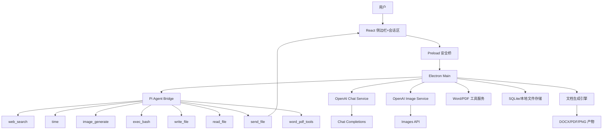
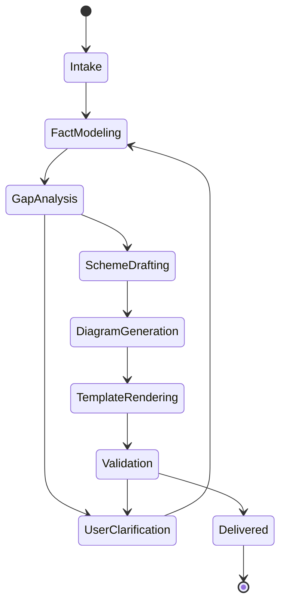

# 密码方案生成Agent技术方案

## 1. 项目目标

### 1.1 建设目标

基于 `pi-agent + Electron + React + shadcn/ui + Redux Toolkit + electron-vite` 构建一个桌面客户端，用于生成专业的密码应用方案。系统应满足以下目标：

1. 以 [密码应用方案.docx](./密码应用方案.docx) 为唯一权威模板，最终交付文档必须保持模板章节、样式、表格和排版结构。
2. 通过对话式交互持续采集项目资料，由模型按任务需要自主调用工具补全《密码应用方案》正文、表格、流程图和技术架构图。
3. Agent 具备上下文记忆、工具调用、生成过程可视化、草稿迭代和文件交付能力。
4. Electron 后端负责 Agent 运行、文档渲染、文件落盘和本地安全存储；React 前端负责会话流界面、过程回放和文件展示。
5. 支持 `send_file` 工具将生成产物推送给前端，前端以聊天流内联文件条目的形式展示，并支持打开、预览、再次导出。
6. Agent 的文本推理层统一采用 OpenAI `Chat Completions` 消息格式，图像生成统一采用 OpenAI 官方 SDK。

### 1.2 非目标

1. 首期不追求做成通用办公文档平台，聚焦“密码应用方案”这一类专业文档。
2. 首期不直接替代人工合规评审，系统输出为专业初稿和可复核稿，保留人工确认环节。
3. 首期不做多人协同和云端账号体系，以单机本地项目制为主。

## 2. 关键约束与设计原则

### 2.1 关键约束

1. 文档必须严格遵循现有 Word 模板，不允许“内容对了但样式变形”。
2. 方案内容要贴近 `GB/T 39786-2021` 的八大维度和模板中的章节结构。
3. 前端需要像 Codex 一样展示 Agent 的思考过程外显结果、工具调用过程和产物流转过程。
4. 工具既要强大，也要可追踪、可审计、可中断。
5. 桌面端需要兼顾网络工具与本地文件能力，但高风险工具必须收敛边界。

### 2.2 设计原则

1. 模板优先：文档生成链路服从模板，不让大模型直接“自由写 Word”。
2. 数据结构化优先：先沉淀项目事实、风险点、密码需求、部署清单，再渲染文档。
3. Agent 可控优先：模型负责分析和编排，关键事实、模板映射、文件交付由宿主程序控制。
4. 结果可复核优先：每一段内容都能追溯到用户输入、模板位置、标准条款或工具结果。
5. 本地优先：项目数据、草稿、模板映射、生成文件默认落在本地。

## 3. 技术选型

### 3.1 总体选型

| 层次 | 技术 |
| --- | --- |
| 桌面壳 | Electron |
| 构建 | electron-vite |
| 前端 | React + TypeScript |
| 状态管理 | Redux Toolkit |
| UI 组件 | shadcn/ui + Tailwind CSS |
| Markdown 渲染 | `@incremark/react` + `@incremark/theme` |
| Agent Runtime | `@earendil-works/pi-coding-agent` |
| LLM / Image SDK | 官方 `openai` JavaScript SDK |
| 文档引擎 | `docx` 模板渲染引擎 + 自定义模板归一化器 |
| 本地存储 | SQLite（推荐 `better-sqlite3`）+ 文件系统 |
| 配置加载 | `dotenv` 或 `electron-vite` env loader |
| 密钥存储 | OS Keychain / `keytar` |
| 图片资产 | 本地 `artifacts/` 目录 + 元数据表 |

### 3.2 Pi-Agent + OpenAI 接入方式

推荐采用“Pi-Agent 做编排，OpenAI SDK 做模型与生图调用”的双层结构：

1. Pi-Agent 负责会话状态、工具编排、记忆管理和事件流。
2. 文本大模型调用统一在 Main 进程内通过 OpenAI SDK 走 `chat.completions`。
3. 生图调用统一在 Main 进程内通过 OpenAI SDK 走 `images.generate`。
4. Pi-Agent 中如果需要模型适配层，则通过自定义 `llm-service` 把内部消息转换为 OpenAI Chat messages。

推荐优先采用 Pi 的 Node SDK，直接在 Electron 主进程内创建 `AgentSession`，不优先走子进程 RPC。

原因如下：

1. Electron 主进程本身就是 Node 运行时，直接接入 SDK 更自然。
2. SDK 原生支持 `createAgentSession()`、`session.subscribe()`、`SessionManager` 和自定义工具，便于把事件流直接映射到前端。
3. 直接接入 SDK 能减少子进程管理、JSONL 协议桥接和 Windows 平台兼容成本。
4. RPC 模式适合作为隔离部署或未来服务化备选。

推荐架构：

1. 主方案：Electron Main 进程内嵌 Pi SDK。
2. 备选方案：Agent Worker 子进程跑 `pi --mode rpc`，Main 进程做协议桥接。

### 3.3 OpenAI 请求格式约束

由于你明确要求“Agent 调用大模型使用 OpenAI chat 格式”，因此文本模型层统一采用：

1. Endpoint：`/v1/chat/completions`
2. SDK：官方 `openai` JavaScript SDK
3. 输入结构：`messages[]`
4. 工具调用：使用 `tools` / `tool_calls`
5. 输出模式：开启 `stream: true`，把增量结果映射为前端流式消息

说明：

OpenAI 当前文档仍提供 `Chat Completions`，虽然官方同时推荐新项目优先考虑 `Responses API`，但本项目按你的约束，文本层仍统一使用 Chat Completions。

### 3.4 `.env` 配置策略

模型配置和生图模型配置统一存放在本地 `.env` 或 `.env.local`：

```env
OPENAI_API_KEY=***
OPENAI_BASE_URL=https://api.openai.com/v1
OPENAI_IMAGE_BASE_URL=
OPENAI_IMAGE_API_KEY=
OPENAI_CHAT_MODEL=gpt-5.5
OPENAI_IMAGE_MODEL=gpt-image-2
OPENAI_IMAGE_SIZE=1536x1024
OPENAI_IMAGE_QUALITY=high
OPENAI_REQUEST_TIMEOUT_MS=120000
OPENAI_IMAGE_REQUEST_TIMEOUT_MS=300000
OPENAI_MAX_OUTPUT_TOKENS=16000
AGENT_EXEC_BASH_ENABLED=true
AGENT_DRAFT_SECTION_PARALLELISM=20
AGENT_IMAGE_GENERATION_PARALLELISM=10
```

设计约束：

1. Renderer 进程不直接读取 API Key。
2. `OPENAI_IMAGE_BASE_URL` 可单独配置生图服务地址；留空时生图沿用 `OPENAI_BASE_URL`。
3. `OPENAI_IMAGE_API_KEY` 可单独配置生图密钥；留空时生图沿用 `OPENAI_API_KEY`。
4. `OPENAI_IMAGE_REQUEST_TIMEOUT_MS` 仅控制 `image_generate` 的单次请求超时，默认 300000 ms（5 分钟）；`OPENAI_REQUEST_TIMEOUT_MS` 不因此被整体延长。
5. `AGENT_IMAGE_GENERATION_PARALLELISM` 控制同时运行的生图任务数，默认 10，可由设置页调低。
6. Pi Agent 作为后端内置依赖直接调用，不再通过环境变量动态加载插件包，也不回退到自实现 OpenAI Chat Runtime。
7. 不使用 `VITE_` 前缀暴露密钥到前端。
8. Main 进程负责读取 `.env` 并向前端下发脱敏后的配置摘要。
9. 设置页如果允许修改配置，应由 Main 进程写回 `.env.local` 并触发重载。
10. 打包时项目根目录 `.env` 会作为只读资源复制到 `resources/.env`，用于给终端用户提供默认模型配置；用户本机 `.env.local` 仍然拥有更高优先级。

## 4. 总体架构



### 4.1 前端职责

1. 侧边栏中的会话导航、新建对话、设置入口。
2. 内容区上层消息流、下层输入区和附件区。
3. 对话输入、消息展示、工具调用内联展示。
4. 结构化资料采集表单和问卷。
5. 章节生成进度、产物列表、文件条目和预览。
6. Agent 状态可视化，包括运行中、暂停、失败、待补充资料。

### 4.2 Electron 主进程职责

1. 作为系统编排中枢，负责 Pi Agent 生命周期管理。
2. 注册和注入自定义工具。
3. 通过 OpenAI SDK 调用 Chat Completions 和 Images API。
4. 管理项目数据、会话数据、生成任务和文件资产。
5. 调用文档引擎，根据模板生成最终 Word 文档。
6. 通过 IPC 向前端推送事件流和产物更新。

### 4.3 Agent Runtime 职责

1. 理解用户需求。
2. 基于项目记忆持续追问缺失信息。
3. 调用标准知识、网络检索、图像生成、本地文件和 Word/PDF 工具。
4. 将用户输入转换为结构化“方案事实模型”。
5. 按模板章节输出高质量正文、表格和图示说明。

### 4.4 文档引擎职责

1. 读取模板。
2. 将结构化数据映射到模板占位区域。
3. 插入表格、图片、图题、分页和版本控制信息。
4. 产出 `.docx`，必要时可联动导出 `.pdf`。

## 5. 核心模块设计

### 5.1 前端模块

| 模块 | 说明 |
| --- | --- |
| `sidebar` | 会话列表、新建对话、设置入口 |
| `project` | 项目列表、创建项目、模板绑定、项目资料维护 |
| `chat` | 对话消息、输入框、停止生成、继续追问、流式渲染 |
| `composer` | 粘贴文件、选择文件、附件预览、发送控制 |
| `stream` | 聊天流中的工具条目、阶段日志、任务状态、文件条目 |
| `workspace` | 章节大纲、事实抽屉、风险分析、生成进度 |
| `artifacts` | 文档列表、图片列表、导出、打开、重新发送 |
| `settings` | 模型、工具权限、存储路径、模板设置 |

### 5.2 Electron 后端模块

| 模块 | 说明 |
| --- | --- |
| `pi-agent-bridge` | 直接调用 `@mariozechner/pi-coding-agent`，接入 Pi Session、流式消息和工具事件 |
| `model-config` | 将 `.env` 中的 OpenAI-compatible 模型配置注册给 Pi Agent SDK |
| `image-service` | OpenAI Images API 调用、图片落盘、元数据登记 |
| `tool-registry` | 注册 `web_search/time/image_generate/...` 自定义工具 |
| `document-tools-service` | Word 读取/填充、PDF 解析/导出、文档预处理 |
| `env-config-service` | 读取 `.env`、写回 `.env.local`、脱敏下发配置摘要 |
| `project-service` | 项目资料、事实模型、章节状态管理 |
| `document-service` | 模板归一化、模板填充、文档输出 |
| `artifact-service` | 图片、Word、PDF、日志等文件管理 |
| `ipc-gateway` | 对前端暴露统一 IPC 接口 |
| `audit-service` | 工具调用日志、错误日志、生成审计 |

### 5.3 数据与存储模块

| 模块 | 说明 |
| --- | --- |
| `SQLite` | 结构化元数据、会话索引、工具日志、项目事实 |
| `files/projects/*` | 原始资料、生成文档、图片、缓存 |
| `template-cache` | 模板归一化结果和模板映射缓存 |
| `memory` | 会话摘要、事实快照、章节完成状态 |

## 6. Agent 设计

### 6.1 Agent 角色定位

Agent 不是简单聊天机器人，而是“密码应用方案编制专员”。它需要同时承担四类职责：

1. 资料采集员：识别缺失信息并追问。
2. 合规分析员：依据标准和模板做需求分析。
3. 方案设计师：输出密码技术框架、部署设计和管理制度建议。
4. 文档编制员：把结构化结果稳定落到 Word 模板。

### 6.2 Agent 运行状态机



### 6.3 记忆体系设计

建议采用四层记忆：

| 记忆层 | 存储内容 | 存储介质 | 用途 |
| --- | --- | --- | --- |
| 会话记忆 | 当前对话、工具调用、最近结论 | Pi Session + SQLite | 维持连续对话 |
| 项目事实记忆 | 建设单位、系统边界、机房、网络、业务、关键数据等 | SQLite JSON 字段 | 文档生成主数据源 |
| 标准知识记忆 | 模板章节规则、GB/T 39786 条款映射、常用密码产品能力模型 | 本地知识库文件 | 提高专业性和一致性 |
| 产物记忆 | 已生成图、表、草稿、最终文档和引用关系 | 文件系统 + SQLite | 复用与追溯 |

### 6.4 记忆策略

1. 对话中抽取稳定事实，写入 `project_facts`，避免事实只存在于上下文窗口里。
2. 对长会话定期生成摘要，写入 `session_summary`，供后续轮次恢复。
3. 章节生成后保存“章节快照”，后续修改时按章节重生成，避免全稿重写。
4. 工具结果只保留必要摘要，原始大文本放入文件资产，避免上下文膨胀。

### 6.5 会话流渲染策略

前端展示建议严格采用“单主线会话流”：

1. Assistant 正文消息使用 Incremark 增量渲染 Markdown。
2. `tool start/update/end` 事件不单独放在侧边时间线，而是插入到对应消息前后的会话流中。
3. `send_file` 结果以文件条目内联到聊天流，并在点击时展开预览或打开。
4. 风险提示、待补资料、阶段切换都以轻量行内块展示，不做多层卡片嵌套。

聊天页面结构固定分为上下两层：

1. 上层：可滚动消息区，只展示用户消息、Agent 消息、工具条目和文件条目。
2. 下层：固定输入区，包含多行输入框、附件选择按钮、粘贴提示、待发送文件列表和发送按钮。
3. 文件支持两种进入方式：系统文件选择和剪贴板粘贴。
4. 输入区需要在流式回复期间支持停止生成、继续补充和附件重发。

这样更接近 Codex 类产品的使用心智，用户沿着一条时间轴就能理解“说了什么、调用了什么、生成了什么”。

## 7. 工具体系设计

### 7.1 工具清单

| 工具 | 用途 | 是否推荐首期开启 |
| --- | --- | --- |
| `web_search` | 检索政策、标准补充信息、厂商公开参数 | 是 |
| `time` | 获取当前时间，填写编制日期、时间戳 | 是 |
| `image_generate` | 生成流程图、技术架构图、封面示意图 | 是 |
| `exec_bash` | 执行本地命令，如格式转换、图片处理、PDF 导出 | 是 |
| `write_file` | 写入中间稿、结构化 JSON、Markdown 草稿 | 是 |
| `read_file` | 读取模板解析结果、规范文本、用户附件 | 是 |
| `read_word` | 读取 `.docx` 文本、表格、占位符和结构摘要 | 是 |
| `plan_scheme_batches` | 按 `template.json` 规划真实章节起草批次 | 是 |
| `plan_scheme_assets` | 按 `template.json` 规划表格单元格和图片任务 | 是 |
| `draft_scheme_sections` | 按批次并行起草章节正文草稿 | 是 |
| `write_word` | 基于规范模板输出 `.docx` | 是 |
| `read_pdf` | 提取 PDF 文本、页码、摘要和元信息 | 是 |
| `export_pdf` | 将 Word 或中间结果导出为 PDF | 是 |
| `send_file` | 将生成文件发送给前端并展示文件条目 | 是 |

### 7.2 工具治理策略

1. `web_search` 结果需要标注来源 URL 和抓取时间。
2. `exec_bash` 只允许在项目工作目录和缓存目录内运行，默认白名单命令。
3. `write_file` 和 `read_file` 需做路径归一化校验，避免越界。
4. `send_file` 不直接暴露任意系统路径，只允许发送已登记到 `artifact-service` 的文件。
5. `image_generate` 先生成结构化图描述，再生成图片，保证图与文一致。
6. Word/PDF 工具只允许访问项目目录、模板目录和系统临时转换目录。
7. Windows 安装包内置 `runtime/win/python` 或兼容历史目录 `runtime/win/pyhton` 时，`exec_bash` 自动把该 Python 运行时注入 PATH，优先提供 `python`、`pip` 等命令。

### 7.3 流程图和技术架构图生成建议

从专业性和可控性看，建议采用“双轨制”：

1. 主轨：先由 Agent 产出结构化图定义，例如节点、分区、连接、图题和说明。
2. 渲染轨：优先用本地结构化图渲染器输出 SVG/PNG，保证拓扑准确。
3. 补充轨：必要时再调用 `image_generate` 做美化版示意图，用于封面或非关键插图。

说明：

合规方案里的网络拓扑图、密码部署图如果完全依赖生图模型，节点名称、连线方向、设备数量容易漂移，因此不建议把 `gpt-image-2` 当作唯一图形生成手段。更稳妥的做法是“结构化图渲染优先，AI 生图补充”。

### 7.4 Word / PDF 工具能力设计

建议把文档处理能力作为 Agent 的内置工具层，而不是让模型直接拼二进制文件。

推荐能力：

1. `read_word`：提取 docx 的段落、表格、图片占位和模板变量。
2. `write_word`：基于规范模板和结构化数据输出最终 docx。
3. `read_pdf`：提取页级文本、页数、标题和关键字段，供 Agent 理解用户上传材料。
4. `export_pdf`：把最终 Word 交付件转成 PDF，供前端预览和发送。

推荐实现：

1. Word 读取：Open XML 解析或 `mammoth` 做文本抽取。
2. Word 输出：模板归一化后走 Open XML 段落级渲染；`docx-templates` 仅处理短字段。
3. 整篇方案生成：`read_file(template.json)` 返回规范化任务清单，`plan_scheme_batches` 规划批次，`draft_scheme_sections` 并行起草，`write_word.sections` 按不可见 SDT 锚批量写入正文，之后 `plan_scheme_assets` 规划表格/图示任务并统一补齐。
4. PDF 读取：`pdfjs-dist` 或同类解析方案。
5. PDF 导出：优先通过本地 LibreOffice / Office 自动化受控导出。

### 7.5 内置 Python Runtime

为降低终端用户环境依赖，Windows 版本支持把 Python 运行时放入 `runtime/win/python`。当前工程同时兼容已有的 `runtime/win/pyhton` 目录，避免因为历史目录名导致打包后不可用。

运行时发现顺序：

1. 打包态优先查找 Electron `resources/runtime/win/python`，再查找 `resources/runtime/win/pyhton`。
2. 开发态查找项目根目录 `runtime/win/python`，再查找 `runtime/win/pyhton`。
3. 如果找到 `python.exe`，`exec_bash` 执行命令时会把 Python 根目录、`Scripts`、`DLLs`、`Library/bin` 注入 PATH，并设置 `PYTHONUTF8=1` 和 `PYTHONIOENCODING=utf-8`。
4. 如果没有找到内置 Python，则保持系统 PATH 行为，继续使用用户本机已有的 Python。
5. 设置页提供运行时自检入口，实际执行 `python --version` 和 `python -m pip --version`，用于确认随包运行时在当前用户电脑上可用。

打包时通过 Electron Builder 的 `extraResources` 把 `runtime`、`docs` 和 `.env` 一起复制到安装包资源目录。`docs` 也作为打包资源处理，是为了保证 `docs/密码应用方案.docx` 在无源码目录的用户电脑上仍可被 `read_word` 和 `write_word` 使用；`.env` 用于提供默认模型配置。

### 7.6 打包态数据目录

开发态为了便于调试，`data/input`、`data/output`、`data/state.json` 和 `.env.local` 仍保存在项目根目录。

Windows 打包态需要避免写入安装目录，因此运行时路径分为两类：

1. 只读资源：`resources/docs`、`resources/runtime`、`resources/.env`，随安装包分发。
2. 可写数据：Electron `userData` 目录下的 `.env.local` 与 `data` 目录，保存模型配置、会话状态、附件副本和生成产物。

这样用户把应用安装到 `Program Files` 或其他受控目录时，Agent 仍能保存配置并生成文件。

## 8. 文档模板引擎设计

### 8.1 现状判断

对 `docs/密码应用方案.docx` 的结构检查表明，该模板是标准 Word `docx` 包结构，但占位符存在被多个 `w:r/w:t` 片段拆开的情况，例如 `${应用系统}` 在 XML 中可能被拆成多个文本 run。

这意味着：

1. 不能用简单字符串替换 `document.xml` 的方式填充。
2. 直接依赖普通占位符模板引擎会存在漏替换和样式破坏风险。

### 8.2 推荐方案

文档模板处理采用“两阶段”：

#### 阶段一：模板归一化

只做一次的离线处理，将原始模板转换为可稳定填充的“规范模板”。

建议动作：

1. 识别被拆分的占位符并重新合并。
2. 将关键变量改造成内容控件、书签或单 run 占位符。
3. 对循环表格、可选段落、图片锚点增加明确标记。
4. 固化模板版本号。

#### 阶段二：运行时渲染

运行时只操作规范模板，不直接修改原始模板。

渲染支持四种对象：

1. 标量字段：如系统名称、建设单位、日期。
2. 表格数据：如设备清单、关键数据清单、经费概算。
3. 富文本段落：如风险分析、设计原则、实施保障文字。
4. 图片对象：如流程图、部署图、架构图。

### 8.3 模板映射模型

建议维护一份独立的模板映射配置：

```json
{
  "templateId": "crypto-scheme-v1",
  "sections": [
    {
      "sectionCode": "2.1.basic_info",
      "target": "table:system_basic_info",
      "dataSource": "project.basicInfo"
    },
    {
      "sectionCode": "5.4.9.workflow",
      "target": "image:workflow_figure",
      "dataSource": "artifacts.workflowDiagram"
    }
  ]
}
```

这样做的价值：

1. 让模板变化和业务逻辑解耦。
2. 后续更换模板时，不必重写全部 Agent 逻辑。

### 8.4 文档生成流水线


### 8.5 质量校验

渲染完成后必须做自动校验：

1. 是否仍存在未替换占位符。
2. 章节标题是否齐全。
3. 表格是否为空或列数异常。
4. 图片是否全部插入成功。
5. 版本、编制日期、项目名称是否一致。

## 9. 方案内容生成模型

### 9.1 统一事实模型

建议使用统一 JSON 作为文档生成中间层：

```json
{
  "project": {
    "name": "示例系统",
    "owner": "示例单位",
    "province": "某省",
    "securityLevel": 3
  },
  "platform": {
    "rooms": [],
    "networkZones": [],
    "servers": [],
    "applications": []
  },
  "cryptoPlan": {
    "requirements": [],
    "devices": [],
    "keyManagement": {},
    "managementControls": {}
  },
  "artifacts": {
    "networkDiagram": "",
    "workflowDiagram": "",
    "deploymentDiagram": ""
  }
}
```

### 9.2 章节生成方式

建议按章节分批生成，而不是整篇一次生成：

1. `1-2章`：系统背景与概述，主要依赖用户基础资料。
2. `3章`：密码应用需求分析，强依赖标准映射和事实抽取。
3. `4-5章`：安全目标、设计原则、密码应用设计，是专业方案核心。
4. `6-8章`：管理制度、实施保障、经费概算，偏模板化和规则化。

优点：

1. 更容易控制质量。
2. 更容易支持局部重生成。
3. 更容易展示进度和人工审核。

## 10. 数据库与文件结构设计

### 10.1 核心表

| 表名 | 说明 |
| --- | --- |
| `projects` | 项目主表 |
| `project_facts` | 结构化事实 |
| `chat_sessions` | 会话元数据 |
| `chat_messages` | 消息记录 |
| `tool_events` | 工具调用日志 |
| `document_jobs` | 文档生成任务 |
| `artifacts` | 文件资产索引 |
| `template_profiles` | 模板版本和映射配置 |

### 10.2 推荐目录结构

```text
PwdSafeAgent/
  .env.example
  docs/
  src/
    main/
      agent/
      ipc/
      services/
      storage/
      tools/
    preload/
    renderer/
      src/
        app/
        features/
        components/
        pages/
  data/
    templates/
    projects/
      {projectId}/
        input/
        cache/
        artifacts/
        output/
```

## 11. 安全设计

### 11.1 本地安全

1. LLM API Key、图像服务 Token 等凭据保存到系统密钥链，不明文入库。
2. `.env` 中的模型配置由 Main 进程读取，Renderer 只接收脱敏后的配置摘要。
3. 生成文档和用户资料默认写入用户可见项目目录，便于审计和备份。
4. 支持敏感字段遮罩显示，例如联系方式、证件号、密钥标识。

### 11.2 工具安全

1. `exec_bash` 实施命令白名单或目录白名单。
2. `read_file/write_file/send_file` 统一走 `artifact-service` 和路径校验。
3. 对可能访问互联网的操作保留抓取时间和来源。

### 11.3 审计能力

系统应记录：

1. 谁在什么时间创建了哪一个项目。
2. 每次生成调用了哪些工具。
3. 最终文档由哪些输入事实和图示构成。
4. 哪一版文档发送给了前端并被用户打开。

## 12. 推荐落地路线

### 12.1 第一阶段

1. 搭建 Electron + React + Redux Toolkit + shadcn/ui 基础工程。
2. 接入 Pi SDK 和 OpenAI SDK，打通最小会话链路。
3. 完成侧边栏 + 内容区 + 上下分层聊天页面。
4. 实现项目事实模型和 SQLite 存储。

### 12.2 第二阶段

1. 完成模板归一化器。
2. 实现章节化文档生成。
3. 支持表格填充、图片插入、Word/PDF 工具和文件发送。
4. 形成首个可交付 `.docx`。

### 12.3 第三阶段

1. 增强记忆体系。
2. 引入标准知识库和案例库。
3. 增加 PDF 导出、方案比对、章节复写。
4. 优化图形生成和审计能力。

## 13. 风险与应对

| 风险 | 说明 | 应对 |
| --- | --- | --- |
| 模板占位符拆分 | 直接替换失败，样式破坏 | 做模板归一化，运行时只用规范模板 |
| 大模型事实漂移 | 会生成看似专业但与用户系统不一致的描述 | 先抽事实再成文，未确认事实不进入定稿 |
| 生图不准确 | 图示中的设备和连线不稳定 | 用结构化图渲染优先，生图补充 |
| 上下文过长 | 长项目会造成成本和性能问题 | 章节化生成 + 摘要记忆 + 项目事实库 |
| 工具越权 | 文件和命令工具存在风险 | 路径校验、白名单、审计日志 |

## 14. 结论

这个系统的关键不在“把大模型接进 Electron”，而在于把大模型放进一个受控的专业文档生产流水线里。推荐采用“Pi SDK 直连主进程 + 结构化事实模型 + 模板归一化 + 章节化渲染”的方案，这条路线最稳，也最适合后续把密码方案从单一模板扩展到测评报告、整改方案、实施方案等更多专业文档。

## 15. 参考选型依据

1. Pi SDK 文档：<https://github.com/earendil-works/pi/blob/main/packages/coding-agent/docs/sdk.md>
2. Pi RPC 文档：<https://github.com/earendil-works/pi/blob/main/packages/coding-agent/docs/rpc.md>
3. Pi Settings 文档：<https://github.com/earendil-works/pi/blob/main/packages/coding-agent/docs/settings.md>
4. Pi 仓库说明：<https://github.com/earendil-works/pi>
5. OpenAI JavaScript SDK 文档：<https://platform.openai.com/docs/libraries/javascript>
6. OpenAI Chat Completions 文档：<https://platform.openai.com/docs/api-reference/chat/create-chat-completion>
7. OpenAI Text Generation / Chat Completions 指南：<https://platform.openai.com/docs/guides/text-generation/chat-completions-api>
8. OpenAI Image Generation 指南：<https://platform.openai.com/docs/guides/image-generation?lang=javascript>
9. 本项目模板：[密码应用方案.docx](./密码应用方案.docx)
10. 本项目标准参考：[密码应用国家标准.md](./密码应用国家标准.md)
## 当前实现基线（2026-05-23）

- Electron 后端已接入本地工具层：`time`、`read_file`、`read_word`、`read_pdf`、`write_file`、`send_file`。
- `read_word` 使用 `mammoth` 从 `.docx` 抽取正文；`docs/密码应用方案.docx` 会作为可读取资源暴露给 Agent，但不会在每轮对话开始时自动读取。
- `read_pdf` 使用 `pdf-parse` 抽取 PDF 文本；文本类附件支持 `.md`、`.txt`、`.json`、`.csv`、`.log`、`.yaml`、`.yml`。
- 用户选择或粘贴的附件会作为可读取资源进入会话；只有当模型判断需要分析资料、生成方案或导出文件时，才调用 `read_word`、`read_pdf` 或 `read_file` 读取内容。
- 仅上传附件的回合会在聊天流中显示附件名称，并作为用户消息进入模型上下文，但不会直接读取文件正文。
- 工具读取结果会进入会话记忆，并由 Pi Agent 桥接层作为后续生成上下文使用。
- 后端已改为强制 `pi-agent` 运行时；不再内置 OpenAI Chat Runtime 回退链路。
- Windows 内置 Python runtime 已接入 `exec_bash`：开发态读取 `runtime/win/python` 或 `runtime/win/pyhton`，打包态读取 `resources/runtime/win/...`，用于无系统 Python 的用户电脑。
- 打包入口已增加 Electron Builder，`runtime` 与 `docs` 会作为 `extraResources` 复制进安装包。
- 打包态已区分只读资源目录和可写用户数据目录：内置 `.env` 读取自 `resources/.env`，`.env.local`、会话状态、附件和输出文件写入 Electron `userData`，避免安装目录不可写。
- 设置页已提供 Python runtime 自检能力，可快速验证内置 Python 和 pip 是否能被主进程正常执行。
- Pi Agent 作为内部依赖直接调用；不再使用本地 mock、动态插件包或 OpenAI Chat Completions 回退。
- 当用户明确要求交付方案文件时，模型应自主调用 `write_word`、`write_pdf`、`write_file` 或 `image_generate` 生成真实产物，并通过 `send_file` 将文件卡片发送给前端；后端不再基于回复内容做启发式自动生成。
